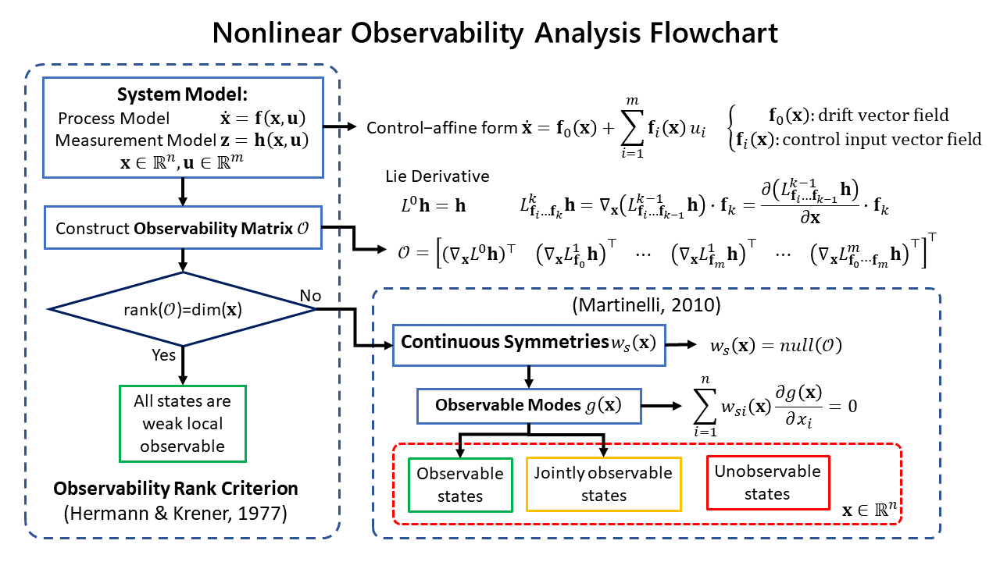

# PyNOA

**PyNOA** is a Python package for conducting the nonlinear observability analysis (NOA) of nonlinear control systems.  
It is based on the concept of the *observability rank criterion* (ORC) by [Hermann & Krener](https://ieeexplore.ieee.org/document/1101601) and the *continuous symmetries* by [Martinelli](https://hal.inria.fr/inria-00421233v3).

The observability analysis gives an insight on
how well the states of a system can be inferred given its *process model* and *measurement model*.  
Basically, if the system is observable, then an observer such as the Kalman filter can be implemented to estimate its states with estimation results that converge to the ground truth.

For a nonlinear system, the observability becomes a local property which brings up the concept of the *weak local observability* and the *observability rank criterion* (ORC) by [Hermann & Krener](https://ieeexplore.ieee.org/document/1101601).
A system is weak local observable if its observability matrix is full rank.
From this point on, we refer to the weak local observable as just observable.

However, in the case the system is not observable, the ORC does not give any information on which states are observable and which are unobservable.
To solve this problem, the concept of *continuous symmetries* by [Martinelli](https://hal.inria.fr/inria-00421233v3) enables us to identify the observable, jointly observable, and unobservable states of a system as shown in the flowchart below.

<p align="center">

</p>

- **Observable** state: an observable mode which consists of an individual state.  
The estimation of this state will converge to the ground truth.
- **Jointly observable** states: an observable mode which consists of a linear combination of states.  
Some states in the joint observable subspace can be made observable provided that some other states' values in the joint observable subspace are already known.  
(TODO: How to figure out which states' values should be known.)
- **Unobservable** state: a state which is not included in the observable modes.  
The estimation of this state will NOT converge to the ground truth, no matter how accurate the model's parameter values.

## Installation

```bash
git clone https://github.com/BagaskaraPutra/PyNOA
cd PyNOA
pip3 install .
```

## Tutorial

1. Define the symbolic variables using `sp.symbols()`.  
Initialize the NOA object using `object = NOA("object_name")`,
then define the state vectors in `sp.Matrix([])`.  
Example:

    ```python
    # State vector
    D, phi_R, theta_R   = sp.symbols("D, phi_R, theta_R")
    mobile_robot        = NOA("mobile_robot_symbolic")
    mobile_robot.x      = sp.Matrix([D, phi_R, theta_R])
    ```

1. Define the vector fields $\mathbf{f}_0, \mathbf{f}_1, ..., \mathbf{f}_m$ of the control-affine form  
$\mathbf{\dot x} = \mathbf{f}_0(\mathbf{x}) +
\sum_{i=1}^m\mathbf{f}_i(\mathbf{x})u_i$  
from the process model function
$\mathbf{\dot x} = \mathbf{f}(\mathbf{x},\mathbf{u})$.  
Vector fields that do not contain control inputs $u_i$ are defined in $\mathbf{f}_0$.  
Vector fields that are linear to the control inputs $u_i$ are defined in $\mathbf{f}_i$.  
Example:

    ```python
    # Control-affine vector fields of process model \dot{x} = f(x,u)
    f0 = sp.zeros(3,1)
    f1 = sp.Matrix([[sp.cos(theta_R-phi_R), sp.sin(theta_R-phi_R)/D, 0]]).T
    f2 = sp.Matrix([[0,0,1]]).T
    mobile_robot.f = [f0, f1, f2]
    ```

1. Define the measurement model  
    Example:

    ```python
    mobile_robot.h = sp.Matrix([sp.pi - theta_R + phi_R])
    ```

1. Choose how to construct the observability matrix.  
    Parameters:  
    - `LD_order`  
        The $k^{th}$ order of the Lie derivative. You can set this with positive integers $> 1$ (greater than one).  
    - `combn_permn_opt`  
    The arrangement of the Lie derivative vector fields from
    the $0^{th}$ order until the $k^{th}$ order  
        - `"permutation"` : permutation of Lie derivatives.
        - `"combination"` : combination of Lie derivatives
        - `"drift2ndOrder` : combination of Lie derivatives only until the $2^{nd}$ order, but the $2^{nd}$ order only has combinations between the drift vector field and control input vector fields $\mathbf{f}_0\mathbf{f}_i$  

    Example:

    ```python
    mobile_robot.LD_order = 2
    mobile_robot.combn_permn_opt = "combination"
    ```

    will calculate the:  
    - $0^{th}$ order Lie derivative:  $L^0\mathbf{h} = \mathbf{h}$
    - $1^{st}$ order Lie derivatives:  
    $L^1_{\mathbf{f}_0}\mathbf{h} = \nabla_{\mathbf{x}} (L^0\mathbf{h})\cdot\mathbf{f}_0$  
    $L^1_{\mathbf{f}_1}\mathbf{h} = \nabla_{\mathbf{x}} (L^0\mathbf{h})\cdot\mathbf{f}_1$  
    $L^1_{\mathbf{f}_2}\mathbf{h} = \nabla_{\mathbf{x}} (L^0\mathbf{h})\cdot\mathbf{f}_2$
    - $2^{nd}$ order Lie derivatives  
    $L^2_{\mathbf{f}_0\mathbf{f}_1}\mathbf{h} = \nabla_{\mathbf{x}} (L^1\mathbf{h}_{\mathbf{f}_0})\cdot\mathbf{f}_1$  
    $L^2_{\mathbf{f}_0\mathbf{f}_2}\mathbf{h} = \nabla_{\mathbf{x}} (L^1\mathbf{h}_{\mathbf{f}_0})\cdot\mathbf{f}_2$  
    $L^2_{\mathbf{f}_1\mathbf{f}_2}\mathbf{h} = \nabla_{\mathbf{x}} (L^1\mathbf{h}_{\mathbf{f}_1})\cdot\mathbf{f}_2$  

    <!-- You can also manually construct the observability matrix using the function `obsv_mat_construct(idx_all_perm, k)`  
    Example: -->

1. Choose the rank calculation option using `rank_calc_opt`  
Options:  
    - `"symbolic"` : Calculate the rank of the observability matrix symbolically.
    - `"numeric"` : Calculate the rank of the observability matrix numerically by substituting the states, parameters, and inputs with numerical values.  
[**WARNING!**] The symbolic calculation may take a long time to complete, in some cases as long as a couple of hours. It is recommended to use the **numeric** option for a system with more than 3 states.

1. Define which symbolic variables to substitute with random prime numbers in `params_config_subs = sp.Matrix([])`.  
[**WARNING!**] Make sure that all symbolic variables in the observability matrix are stated in `params_config_subs`. If there are remaining symbolic variables in the observability matrix but not stated in `params_config_subs`, it will remain symbolic and may **increase computation time**.
    - *Example 1*:  
    This will substitute random prime numbers into `mobile_robot_num.x` in the observability matrix.

    ```python
    mobile_robot_num.params_config_subs = sp.Matrix([mobile_robot_num.x])
    ```

    - *Example 2*:  
    This will substitute random prime numbers into  `[x_T, x_G, x_I, u]` in the observability matrix.

    ```python
    imu_baro.params_config_subs = sp.Matrix([x_T, x_G, x_I, u])
    ```

    - *Example 3*:  
    This will substitute random prime numbers into `[x_T, x_G]`. However, the variables `[x_I, u]` in the observability matrix remains symbolic.

    ```python
    imu_baro.params_config_subs = sp.Matrix([x_T, x_G])
    ```

1. Choose the nullspace calculation option using `null_calc_opt`  
Options:  
    - `"symbolic"` : Calculate the nullspace of the observability matrix symbolically.
    - `"numeric"` : Calculate the nullspace of the observability matrix numerically by substituting the states, parameters, and inputs with numerical values.

## Example Jupyter Notebooks

1. **martinelli_2010_mobileRobot2D.ipynb**

> Agostino Martinelli. "**Continuous Symmetries and Observability Properties in Autonomous Navigation.**" [Research Report] RR-7049, INRIA. 2010.

2. **ko_2019_quadrotor_inertialNavigation.ipynb**

> N. Y. Ko, I. H. Choi, G. Song and W. Youn, "**Three-Dimensional Dynamic-Model-Aided Navigation of Multirotor Unmanned Aerial Vehicles,**" _in IEEE Access, vol. 7, pp. 170715-170732_, 2019, doi: 10.1109/ACCESS.2019.2955756.